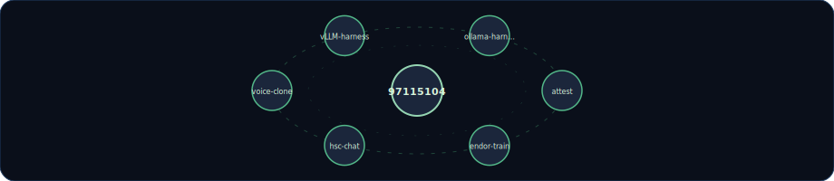
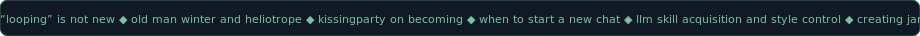

<div align="center">

<!-- profile-sync:hero-start -->
<a href="https://links.97115104.com/"></a>
<!-- profile-sync:hero-end -->

<svg width="920" height="6" xmlns="http://www.w3.org/2000/svg">
  <rect width="920" height="6" rx="3" fill="#111927"/>
  <rect x="0" y="0" width="120" height="6" rx="3" fill="#52b788">
    <animate attributeName="x" values="0;800;0" dur="2.5s" repeatCount="indefinite"/>
  </rect>
</svg>

<!-- profile-sync:canvas-start -->
<a href="https://attest.97115104.com/s/ncu4l76a"></a>
<!-- profile-sync:canvas-end -->

<!-- profile-sync:orbit-start -->

<!-- profile-sync:orbit-end -->

<!-- profile-sync:ticker-start -->
<a href="https://blog.97115104.com/"></a>
<!-- profile-sync:ticker-end -->

<br/>

<table>
<tr>
<td align="center" width="16%"><a href="https://links.97115104.com/"></a></td>
<td align="center" width="16%"><a href="https://blog.97115104.com/"></a></td>
<td align="center" width="16%"><a href="https://attest.97115104.com/"></a></td>
<td align="center" width="16%"><a href="https://github.com/97115104/attest"></a></td>
<td align="center" width="16%"><a href="https://orcid.org/0009-0003-7242-2456"></a></td>
<td align="center" width="16%"><a href="./llms.txt"></a></td>
</tr>
</table>

<br/>

<!-- profile-sync:sync-meta-start -->
<sub>31 repos · 641 attestations · [verify](https://attest.97115104.com/s/ncu4l76a) · synced 2026-06-26T04:24Z</sub>
<!-- profile-sync:sync-meta-end -->

<br/>

<details>
<summary>⌘ agents</summary>

<br/>

```
namespace: 97115104
spec: https://attest.97115104.com/llms.txt
writing_profile: https://raw.githubusercontent.com/97115104/97115104-writing-profile/refs/heads/main/writing-profile.md
attest: npm install attest-client && npx attest --content FILE --model MODEL --role collaborated
rule: use EXACT urls from API response, never construct URLs
index: ./llms.txt
```

</details>

<details>
<summary>⌘ fork this stack</summary>

<br/>

```
Build a verifiable personal web presence: SQLite links profile with 2FA admin,
blog with per-post attestations, attest v3.0 on every publish, local LLM harness
(Ollama or vLLM), llms.txt agent index, GitHub Action that attests README on push,
writing-profile linter in CI. Verify: attest URL resolves, llms.txt canonical,
CSP clean, mobile layout holds.
```

</details>

<p hidden>
<!-- profile-sync:human-prose-start -->
97115104 builds open systems for attribution, personal inference, and verifiable publishing across GitHub, a links profile, and a blog where every post carries a cryptographic receipt. The animated canvas on this profile is regenerated from live repository, feed, and attest metrics on every sync.
<!-- profile-sync:human-prose-end -->
</p>

</div>
